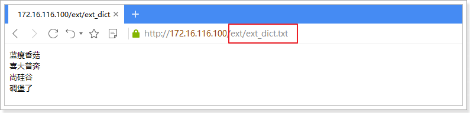
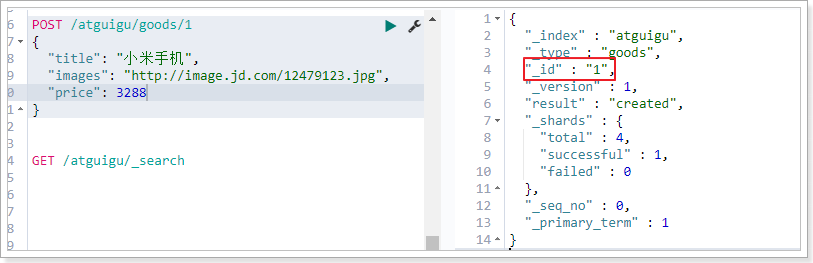
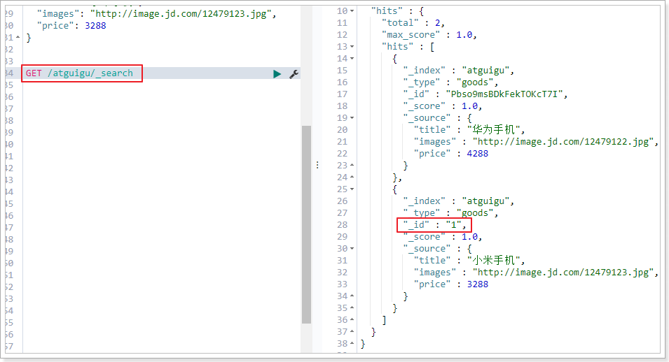
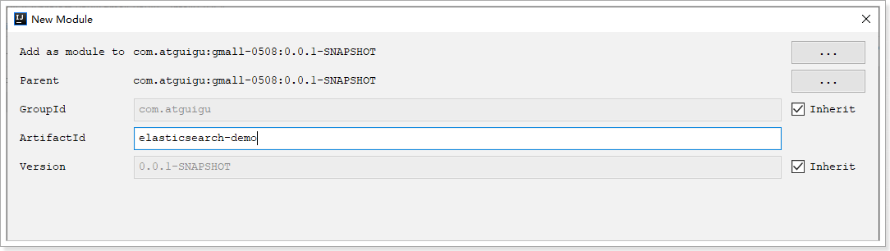

搜索引擎


# 1. 了解搜索技术

## 1.1.   什么是搜索

什么是搜索， 计算机根据用户输入的关键词进行匹配，从已有的数据库中摘录出相关的记录反馈给用户。 

 

线性匹配：

select * from item where title like ’%小米%‘


## 1.2.   新业务需求

比如，用户在百度文本框中输入，“吃饭睡觉写程序”，会出现的以下结果：


从结果可以看出，百度搜索具备以下明显特点：

   1、即使在相关结果数量接近3600万时，也能快速得出结果。

   2、搜索的结果不仅仅局限于完整的“吃饭睡觉写程序”这一短语，而是将此短语拆分成，“写程序”，“吃饭”，“睡觉”，“程序”等关键字。

   3、对拆分后的搜索关键字进行标红显示。

   4、即使只满足部分关键字也能查询出来

   5、即使输错一两个字母也能查询出来，例如：搜索facebool，能查询到Facebook

   问题：上述功能，使用大家以前学过的数据库搜索能够方便实现吗？


## 1.3.   搜索引擎

搜索引擎（search engine）是一种信息检索系统，旨在协助搜索存储在计算机系统中的信息。                          

 

搜索引擎按照功能通常分为垂直搜索和综合搜索。

​      1、垂直搜索是指专门针对某一类信息进行搜索。例如：会搜网 主要做商务搜索的，并且提供商务信息。除此之外还有爱看图标网、职友集等。

​      2、综合搜索是指对众多信息进行综合性的搜索。例如：百度、谷歌、搜狗、360搜索等。

​      3、站内搜索是指对网站内的信息进行的搜索。例如：京东、招聘网站等

​      4、软件内部搜索，例如word、eclipse、idea等


## 1.4.   倒排索引

搜索引擎目前主流的实现原理：倒排索引技术

**倒排索引又叫反向索引**（如下图）以字或词为关键字进行索引，表中关键字所对应的记录表项，记录了出现这个字或词的所有文档，每一个表项记录该文档的编号和关键字在该文档中出现的位置情况。


在实际的运用中，我们可以对数据库中原始的数据结构（如：商品表），在业务空闲时，事先生成**文档列表（左图）及倒排索引区域（右图）**。

用户有查询需求时，**先访问倒排索引数据区域**（右图），得出文档编号后，通过文档编号即可快速，准确的**通过左图找到具体的文档内容**。

 例如：用户输入“跳槽”关键字，先到右图的索引区查询，找到1,4；再根据id=1和id=4到左图找到两条记录。整个过程走的都是索引，比传统的链式匹配更加快速。


## 1.5.   认识lucene

倒排索引技术只是底层原理，我们可以自己写代码实现。也可以使用开源组织写好的方案：lucene。

官网：http://lucene.apache.org

- Lucene是一套用于**全文检索**和搜寻的开源程序库，由Apache软件基金会支持和提供

- Lucene提供了一个简单却强大的应用程序接口（API），能够做全文索引和搜寻，在Java开发环境里Lucene是一个成熟的免费开放源代码工具

- Lucene并不是现成的搜索引擎产品，但可以用来制作搜索引擎产品。例如：solr和elasticsearch


## 1.6.   什么是全文检索


倒排索引是全文检索技术的一种实现方式。


# 2.  elasticsearch

lucene只是一个提供全文搜索功能类库的核心工具包，而真正使用它还需要一个完善的服务框架搭建起来的应用。

**lucene是类似于servlet，而搜索引擎就是tomcat 。**

目前市面上流行的搜索引擎软件，主流的就两款：elasticsearch和solr。这两款都是基于lucene的搭建的，可以独立部署启动的搜索引擎服务软件。由于内核相同，所以两者除了服务器安装、部署、管理、集群以外，对于数据的操作，修改、添加、保存、查询等等都十分类似。就好像都是支持sql语言的两种数据库软件。只要学会其中一个另一个很容易上手。

从实际企业使用情况来看，elasticSearch的市场份额逐步在取代solr，国内百度、京东、新浪都是基于elasticSearch实现的搜索功能。国外就更多了 像维基百科、GitHub、Stack Overflow等等也都是基于ES的。


## 2.1.   elastic

Elastic官网：https://www.elastic.co/cn/

中文文档：https://elasticsearch.apachecn.org/#/


Elastic有一条完整的产品线及解决方案：**Elasticsearch、Kibana**、Logstash等，前面说的三个就是大家常说的ELK技术栈。实现企业海量日志的处理分析的解决方案。大数据领域的重要一份子。


## 2.2.   elasticsearch


最新版本7.4.0， 我们这里使用6.8.1版本。


## 2.3.   下载

这里只学习elasticsearch和kibana，官网下载地址如下：

elasticsearch：https://www.elastic.co/cn/downloads/past-releases#elasticsearch

kibana：https://www.elastic.co/cn/downloads/past-releases#kibana

ik分词器：https://github.com/medcl/elasticsearch-analysis-ik/releases

可以去官网下载特定版本，建议和我的版本一致。6.8.1版本

**注意：kibana、elasticsearch和IK分词器的版本号要一致，否则可能带来兼容性问题**

另外，需要jdk1.8以上环境。


## 2.4.   安装elasticsearch

把课前资料中的elasticsearch和kibana拷贝到/opt目录下


### 2.4.1.    安装

1. 安装elasticsearch：`rpm -ivh elasticsearch-6.8.1.rpm`

2. 为elasticsearch配置jdk：`vim /etc/sysconfig/elasticsearch`


### 2.4.2.    配置elasticsearch

切换到/etc/elasticsearch目录下，看到两个配置文件jvm.options和elasticsearch.yml


首先修改jvm.options。elasticsearch默认占用所有内存，导致虚拟机很慢，可以改的小一点。

```
vim /etc/elasticsearch/jvm.options
```


**两个值必须相等**


修改elasticsearch.yml配置文件

**修改yml配置的注意事项：**

​		**每行必须顶格，不能有空格**

​		**“：”后面必须有一个空格**

​		


1. 集群名称，同一集群名称必须相同（可选，集群是要配置）


2. 单个节点名称 （可选，集群是要配置）


3. 默认只允许本机访问，修改为0.0.0.0后则可以远程访问；端口使用默认：9200


4. 把bootstrap自检程序关掉

```shell
bootstrap.memory_lock: false
bootstrap.system_call_filter: false
```


5. 配置集群列表，这里只有一个。可以配置计算机名，也可以配置ip


主机名是你计算机名，一定不可以写错！！


### 2.4.3.    重启

启动elasticsearch：`systemctl start elasticsearch`


centos6：`service elasticsearch start`


如果启动未成功，请去查看相关日志

vim  /var/log/elasticsearch/{cluster-name}.log

例如：这里cluster-name配置的是my-es，那么就是指：vim  /var/log/elasticsearch/my-es.log文件


### 2.4.4.    测试

```
[root@joedy elasticsearch]# curl http://localhost:9200
{
  "name" : "node-1",
  "cluster_name" : "my-es",
  "cluster_uuid" : "ebSnWv9LQnqFEZ7TrZAzmQ",
  "version" : {
    "number" : "6.8.1",
    "build_flavor" : "default",
    "build_type" : "rpm",
    "build_hash" : "1fad4e1",
    "build_date" : "2019-06-18T13:16:52.517138Z",
    "build_snapshot" : false,
    "lucene_version" : "7.7.0",
    "minimum_wire_compatibility_version" : "5.6.0",
    "minimum_index_compatibility_version" : "5.0.0"
  },
  "tagline" : "You Know, for Search"
}
```

在浏览器端测试：


### 2.4.3.   cluster_block_exception

如果elasticsearch服务器硬盘剩余空间不足5%，会抛出cluster_block_exception异常，解决方案参照官方文档：

https://www.elastic.co/guide/en/elasticsearch/reference/6.2/disk-allocator.html

在elasticsearch.yml中取消硬盘检查。


在elasticsearch.yml配置文件中末尾，追加这个配置：

```yml
cluster.routing.allocation.disk.threshold_enabled: false
```


## 2.5.   centos6启动错误解决方案

### 2.5.1.    错误1：内核过低


我们使用的是centos6，其linux内核版本为2.6。而Elasticsearch的插件要求至少3.5以上版本。不过没关系，我们禁用这个插件即可。

修改elasticsearch.yml文件，在最下面添加如下配置：

```
bootstrap.system_call_filter: false
```

然后重启


### 2.5.2.    错误2：文件权限不足

再次启动，又出错了：


```
[1]: max file descriptors [4096] for elasticsearch process likely too low, increase to at least [65536]
```

我们用的是leyou用户，而不是root，所以文件权限不足。

**首先用root用户登录。**

然后修改配置文件:

```
vim /etc/security/limits.conf
```

添加下面的内容：

```
* soft nofile 65536

* hard nofile 131072

* soft nproc 4096

* hard nproc 4096
```


### 2.5.3.    错误3：线程数不够

刚才报错中，还有一行：

```
[1]: max number of threads [1024] for user [xxx] is too low, increase to at least [4096]
```

这是线程数不够。

继续修改配置：

```
vim /etc/security/limits.d/90-nproc.conf 
```

修改下面的内容：

```
* soft nproc 1024
```

改为：

```
* soft nproc 4096
```


### 2.5.4.    错误4：进程虚拟内存

```
[3]: max virtual memory areas vm.max_map_count [65530] likely too low, increase to at least [262144]
```

vm.max_map_count：限制一个进程可以拥有的VMA(虚拟内存区域)的数量，继续修改配置文件， ：

```
vim /etc/sysctl.conf 
```

添加下面内容：

```
vm.max_map_count=655360
```

然后执行命令：

```
sysctl -p
```


## 2.6.   安装kibana

解压缩进入kibana的config目录：


修改配置文件，允许访问的ip地址


配置elasticsearch服务器列表：


启动：切换到kibana的bin目录下

```shell
./kibana   # 会输出日志，并独占当前窗口
nohup ./kibana &  # 后台启动
```


日志文件就生成在bin目录下：


注意：不要使用`ps -ef | grep kibana`查询kibana进程，因为kibana的进程不叫kibana


测试：通过浏览器访问kibana


点击左边菜单DevTools 

在Console中，执行 get _cluster/health    

右边的结果中，status为yellow或者green。

表示es启动正常，并且与kibana连接正常。


## 2.7.   IK分词器

### 2.7.1.    中文问题

大家先不管语法，我们先测试一波。

在kibana控制台输入下面的请求：

```
GET _analyze
{
  "text": "我是中国人"
}
```

运行得到结果：

```
{
  "tokens" : [
    {
      "token" : "我",
      "start_offset" : 0,
      "end_offset" : 1,
      "type" : "<IDEOGRAPHIC>",
      "position" : 0
    },
    {
      "token" : "是",
      "start_offset" : 1,
      "end_offset" : 2,
      "type" : "<IDEOGRAPHIC>",
      "position" : 1
    },
    {
      "token" : "中",
      "start_offset" : 2,
      "end_offset" : 3,
      "type" : "<IDEOGRAPHIC>",
      "position" : 2
    },
    {
      "token" : "国",
      "start_offset" : 3,
      "end_offset" : 4,
      "type" : "<IDEOGRAPHIC>",
      "position" : 3
    },
    {
      "token" : "人",
      "start_offset" : 4,
      "end_offset" : 5,
      "type" : "<IDEOGRAPHIC>",
      "position" : 4
    }
  ]
}
```


### 2.7.2.    中文分词器

elasticsearch本身自带的中文分词，就是单纯把中文一个字一个字的分开，根本没有词汇的概念。但是实际应用中，用户都是以词汇为条件，进行查询匹配的，如果能够把文章以词汇为单位切分开，那么与用户的查询条件能够更贴切的匹配上，查询速度也更加快速。

因此一般我们会用第三方提供的分词器：

       

一般我们用IK分词器。


### 2.7.3.    IK分词器

Lucene的IK分词器早在2012年已经没有维护了，现在我们要使用的是在其基础上维护升级的版本，并且开发为ElasticSearch的集成插件了，与Elasticsearch一起维护升级，版本也保持一致：6.8.1。

下载地址：https://github.com/medcl/elasticsearch-analysis-ik/releases

上传课前资料中的zip包，并解压到：/usr/share/elasticsearch/plugins/

```
unzip elasticsearch-analysis-ik-6.8.1.zip -d ik-analyzer
```


重启elasticsearch，再次测试：

```
GET _analyze
{
  "analyzer": "ik_smart", 
  "text": "我是中国人"
}
```


ik分词器还提供了更详尽的分词方式：**ik_max_word**

```
GET _analyze
{
  "analyzer": "ik_max_word", 
  "text": "我是中国人"
}
```

分词效果：

```
{
  "tokens" : [
    {
      "token" : "我",
      "start_offset" : 0,
      "end_offset" : 1,
      "type" : "CN_CHAR",
      "position" : 0
    },
    {
      "token" : "是",
      "start_offset" : 1,
      "end_offset" : 2,
      "type" : "CN_CHAR",
      "position" : 1
    },
    {
      "token" : "中国人",
      "start_offset" : 2,
      "end_offset" : 5,
      "type" : "CN_WORD",
      "position" : 2
    },
    {
      "token" : "中国",
      "start_offset" : 2,
      "end_offset" : 4,
      "type" : "CN_WORD",
      "position" : 3
    },
    {
      "token" : "国人",
      "start_offset" : 3,
      "end_offset" : 5,
      "type" : "CN_WORD",
      "position" : 4
    }
  ]
}
```

分词更完美！！


### 2.7.4.    自定义词库

中文语言在不断发展，新的词汇不断涌现，怎么不断完善分词需求？

ik分词器提供了重要的扩展能力：

**扩展词典**（新创建词功能）： 有些词IK分词器不识别 例如：“尚硅谷”，“蓝瘦香菇”，“碉堡了”

**停用词典**（停用某些词功能）： 有些词不需要建立索引  例如：“哦”，“啊”，“的”

elasticsearch加载ik分词器插件时，ik会读取一个配置文件，这个配置文件在ik分词器根目录的config目录下：


打开该配置文件：


这里有两种方式配置扩展词典和停用词典：

1. 本地方式：ext_dict配置扩展词典，ext_stopwords配置停用词典。
2. 远程方式：tomcat或者nginx

第一种方式每次修改词典都要重启搜索服务，不推荐。推荐使用nginx的方式，并发量大，修改内容不需要重启。


**第一步：利用nginx搭建远程词库。**


需要在nginx根目录下创建对应的elasticsearch目录


添加扩展词典，**每行一个关键词**：


测试：




**第二步：在ik分词器中引用远程词库**

进入ik分词器的conf目录：cd /usr/share/elasticsearch/plugins/ik-analyzer/config/


**重启elasticsearch服务**，再次测试


分词效果就是好！​


添加新词条后，es只会对新增的数据用新词分词。历史数据是不会重新分词的。如果想要历史数据重新分词。需要执行：

```
POST {index}/_update_by_query?conflicts=proceed
```


# 3. elasticsearch基本操作

## 3.1.   基本概念

Elasticsearch也是基于Lucene的全文检索库，本质也是存储数据，很多概念与MySQL类似的。

|          | 说明                                                         |
| :------: | :----------------------------------------------------------- |
| cluster  | 整个elasticsearch 默认就是集群状态，整个集群是一份完整、互备的数据。 |
|   node   | 集群中的一个节点，一般只一个进程就是一个node                 |
|  shard   | 分片，即使是一个节点中的数据也会通过hash算法，分成多个片存放，默认是5片。 |
|  index   | 索引。相当于rdbms的database, 对于用户来说是一个逻辑数据库，虽然物理上会被分多个shard存放，也可能存放在多个node中。 |
|   type   | 类似于rdbms的table，但是与其说像table，其实更像面向对象中的class , 同一Json的格式的数据集合。（**7.x以上没有了，需要注意！！！**） |
| document | 文档。类似于rdbms的 row、面向对象里的object                  |
|  field   | 字段。相当于字段、属性                                       |
| mappings | 映射。字段的数据类型、属性、是否索引、是否存储等特性         |

对比关系（**7.x以后，以下对应关系作废！！！！**）：

```
索引（indices）----------------------Databases 数据库

  类型（type）--------------------------Table 数据表

     文档（Document）----------------------Row 行

	    字段（Field）-------------------------Columns 列 
```


数据结构对比

```java
public class  Movie {
    String id;
    String name;
    Double doubanScore;
    List<Actor> actorList;
}

public class Actor{
    String id;
    String name;
}
```

这两个对象如果放在关系型数据库保存，会被拆成2张表，但是elasticsearch是用一个json来表示一个document

所以他保存到es

```json
{
    “id”:”1”,
    “name”:”operation red sea”,
    “doubanScore”:”8.5”,
    “actorList”:[  
        {“id”:”1”,”name”:”zhangyi”},
        {“id”:”2”,”name”:”haiqing”},
        {“id”:”3”,”name”:”zhanghanyu”}
    ]
}
```


要注意的是：Elasticsearch本身就是分布式的，因此即便你只有一个节点，Elasticsearch默认也会对你的数据进行分片和副本操作，当你向集群添加新数据时，数据也会在新加入的节点中进行平衡。


## 3.2.   索引操作（indeces）

### 3.2.1.    查询索引

查看es中有哪些索引库：

```
GET /_cat/indices?v
```


es 中会默认存在一个名为.kibana和.kibana_task_manager的索引

表头的含义

|     字段名     | 含义说明                                                     |
| :------------: | :----------------------------------------------------------- |
|     health     | green(集群完整) yellow(单点正常、集群不完整) red(单点不正常) |
|     status     | 是否能使用                                                   |
|     index      | 索引名                                                       |
|      uuid      | 索引统一编号                                                 |
|      pri       | 主节点几个                                                   |
|      rep       | 从节点几个                                                   |
|   docs.count   | 文档数                                                       |
|  docs.deleted  | 文档被删了多少                                               |
|   store.size   | 整体占空间大小                                               |
| pri.store.size | 主节点占                                                     |


### 3.2.2.   创建索引

```
PUT /索引名
```

参数可选：指定分片及副本，默认分片为5，副本为2。

```
{
    "settings": {
        "number_of_shards": 3,
        "number_of_replicas": 2
      }
}
```

演示：说明索引创建成功


再次查询，可以看到刚刚创建的索引：


### 3.2.3.    查看索引具体信息

```
GET /索引名
```


或者，我们可以使用*来查询所有索引具体信息


### 3.2.4.    删除索引

```
DELETE /索引库名
```

演示：


查看atguigu:


## 3.3.   映射配置（_mapping）

索引有了，接下来肯定是添加数据。但是，在添加数据之前必须定义映射。

什么是映射？

> 映射是定义文档的过程，文档包含哪些字段，这些字段是否保存，是否索引，是否分词等

只有配置清楚，Elasticsearch才会帮我们进行索引库的创建（不一定）

solr：store--》true

es：所有字段都会保存到_source字段中

是否保存：取决于是否在查询结果集中展示该字段

是否索引：取决于是否以该字段搜索

是否分词：前提是字符串数据，必须以该字段进行检索。就应该使用分词（text），指定分词器（ik_max_word）


### 3.3.1.    创建映射字段

```json
PUT /索引库名/_mapping/类型名称   (7.x以上： PUT /索引库名/_mapping)
{
  "properties": {
    "字段名": {
      "type": "类型",
      "index": true，
      "store": true，
      "analyzer": "分词器"
    }
  }
}
```

类型名称：就是前面将的type的概念，类似于数据库中的不同表

字段名：类似于列名，properties下可以指定许多字段。

每个字段可以有很多属性。例如：

- type：类型，可以是text、long、short、date、integer、object等
- index：是否索引，默认为true
- store：是否存储，默认为false
- analyzer：分词器，这里使用ik分词器：`ik_max_word`或者`ik_smart`


> 示例

发起请求：

```json
PUT atguigu/_mapping/goods
{
  "properties": {
    "title": {
      "type": "text",
      "analyzer": "ik_max_word"
    },
    "images": {
      "type": "keyword",
      "index": "false"
    },
    "price": {
      "type": "long"
    }
  }
}

## 7.x以上
PUT atguigu/_mapping/_doc
```

响应结果：

```
{
  "acknowledged": true
}

```


### 3.3.2.    查看映射关系

> 语法：

```
GET /索引库名/_mapping
```

> 示例：

```
GET /atguigu/_mapping
```

> 响应：

```json
{
  "atguigu" : {
    "mappings" : {
      "goods" : {
        "properties" : {
          "images" : {
            "type" : "keyword",
            "index" : false
          },
          "price" : {
            "type" : "long"
          },
          "title" : {
            "type" : "text",
            "analyzer" : "ik_max_word"
          }
        }
      }
    }
  }
}
```


### 3.3.3.    字段属性详解

#### 3.3.3.1.     type

Elasticsearch中支持的数据类型非常丰富：


我们说几个关键的：

- String类型，又分两种：

  - text：可分词，不可参与聚合
  - keyword：不可分词，数据会作为完整字段进行匹配，可以参与聚合

- Numerical：数值类型，分两类

  - 基本数据类型：long、interger、short、byte、double、float、half_float
  - 浮点数的高精度类型：scaled_float
    - 需要指定一个精度因子，比如10或100。elasticsearch会把真实值乘以这个因子后存储，取出时再还原。

- Date：日期类型

  elasticsearch可以对日期格式化为字符串存储，但是建议我们存储为毫秒值，存储为long，节省空间。


#### 3.3.3.2.     index

index影响字段的索引情况。

- true：字段会被索引，则可以用来进行搜索。默认值就是true
- false：字段不会被索引，不能用来搜索

index的默认值就是true，也就是说你不进行任何配置，所有字段都会被索引。

但是有些字段是我们不希望被索引的，比如商品的图片信息，就需要手动设置index为false。


#### 3.3.3.3.     store

是否将数据进行额外存储。

Elasticsearch在创建文档索引时，会将文档中的原始数据备份，保存到一个叫做`_source`的属性中。而且我们可以通过过滤`_source`来选择哪些要显示，哪些不显示。

而如果设置store为true，就会在`_source`以外额外存储一份数据，多余，因此一般我们都会将store设置为false，事实上，**store的默认值就是false。**


## 3.4.   新增文档（document）

有了索引、类型和映射，就可以对文档做增删改查操作了。

### 3.4.1.    自动生成id

语法：

```
POST /索引库名/类型名
{
    "key":"value"
}

## 7.1以上
POST /索引库名/_doc
{
    "key":"value"
}

```

示例：

```
POST /atguigu/goods
{
  "title": "华为手机",
  "images": "http://image.jd.com/12479122.jpg",
  "price": 4288
}

## 7.x以上
POST /atguigu/_doc
{
  "title": "华为手机",
  "images": "http://image.jd.com/12479122.jpg",
  "price": 4288
}
```

测试：


查询看看结果：


- `_source`：源文档信息，所有的数据都在里面。
- `_id`：这条文档的唯一标示，与文档自己的id字段没有关联


### 3.4.2.    自定义id

如果我们想要自己新增的时候指定id，可以这么做：

```
POST /索引库名/类型/id值
{
    ...
}

## 7.x以上
POST /索引库名/_doc/id值
{
    ...
}
```

演示：



查询得到两条数据：小米手机的id是我们指定的id




### 3.4.3.    智能判断

事实上Elasticsearch非常智能，你不需要给索引库设置任何mapping映射，它也可以根据你输入的数据来判断类型，动态添加数据映射。

测试一下：

```json
POST /atguigu/goods/2
{
    "title":"小米手机",
    "images":"http://image.jd.com/12479122.jpg",
    "price":2899,
    "stock": 200,
    "saleable":true,
    "attr": {
        "category": "手机",
        "brand": "小米"
    }
}

## 7.x 以上
POST /atguigu/_doc/2
{
    "title":"小米手机",
    "images":"http://image.jd.com/12479122.jpg",
    "price":2899,
    "stock": 200,
    "saleable":true,
    "attr": {
        "category": "手机",
        "brand": "小米"
    }
}
```

我们额外添加了stock库存，saleable是否上架，attr其他属性几个字段。

来看结果：`GET /atguigu/_search`

```json
{
  "took" : 7,
  "timed_out" : false,
  "_shards" : {
    "total" : 2,
    "successful" : 2,
    "skipped" : 0,
    "failed" : 0
  },
  "hits" : {
    "total" : 2,
    "max_score" : 1.0,
    "hits" : [
      {
        "_index" : "atguigu",
        "_type" : "goods",
        "_id" : "1",
        "_score" : 1.0,
        "_source" : {
          "title" : "华为手机",
          "images" : "http://image.jd.com/12479122.jpg",
          "price" : 4288
        }
      },
      {
        "_index" : "atguigu",
        "_type" : "goods",
        "_id" : "2",
        "_score" : 1.0,
        "_source" : {
          "title" : "小米手机",
          "images" : "http://image.jd.com/12479122.jpg",
          "price" : 2899,
          "stock" : 200,
          "saleable" : true,
          "attr" : {
            "category" : "手机",
            "brand" : "小米"
          }
        }
      }
    ]
  }
}
```

再看下索引库的映射关系: `GET /atguigu/_mapping`

```json
{
  "atguigu" : {
    "mappings" : {
      "goods" : {
        "properties" : {
          "attr" : {
            "properties" : {
              "brand" : {
                "type" : "text",
                "fields" : {
                  "keyword" : {
                    "type" : "keyword",
                    "ignore_above" : 256
                  }
                }
              },
              "category" : {
                "type" : "text",
                "fields" : {
                  "keyword" : {
                    "type" : "keyword",
                    "ignore_above" : 256
                  }
                }
              }
            }
          },
          "images" : {
            "type" : "keyword",
            "index" : false
          },
          "price" : {
            "type" : "long"
          },
          "saleable" : {
            "type" : "boolean"
          },
          "stock" : {
            "type" : "long"
          },
          "title" : {
            "type" : "text",
            "analyzer" : "ik_max_word"
          }
        }
      }
    }
  }
}
```

stock，saleable，attr都被成功映射了。

如果是字符串类型的数据，会添加两种类型：text + keyword。如上例中的category 和 brand


## 3.6.   修改数据

修改数据分为，整体覆盖和修改某一个字段。

### 3.6.1.   整体覆盖

把刚才新增的请求方式改为PUT。不过必须指定id，

- id对应文档存在，则修改
- id对应文档不存在，则新增

比如，我们把id为2的数据进行修改：

```json
PUT /atguigu/goods/2
{
    "title":"超米手机",
    "images":"http://image.jd.com/12479122.jpg",
    "price":2999,
    "stock": 200,
    "saleable":true,
    "attr": {
        "category": "手机",
        "brand": "小米"
    }
}

## 7.x 以上

PUT /atguigu/_doc/2
{
    "title":"超米手机",
    "images":"http://image.jd.com/12479122.jpg",
    "price":2999,
    "stock": 200,
    "saleable":true,
    "attr": {
        "category": "手机",
        "brand": "小米"
    }
}
```

结果：`GET /atguigu/goods/2`  (**7.x 以上：GET /atguigu/_doc/2** )

```json
{
  "_index" : "atguigu",
  "_type" : "goods",
  "_id" : "2",
  "_version" : 7,
  "_seq_no" : 7,
  "_primary_term" : 1,
  "found" : true,
  "_source" : {
    "title" : "超米手机",
    "images" : "http://image.jd.com/12479122.jpg",
    "price" : 2899,
    "stock" : 200,
    "saleable" : true,
    "attr" : {
      "category" : "手机",
      "brand" : "小米"
    }
  }
}
```

**这种方式必须有所有字段，否则会导致更新后的数据字段缺失。**


### 3.6.2.    更新字段

语法：

```json
POST /{index}/{type}/{id}/_update
{
	"doc": {
		字段名: 字段值
	}
}

## 7.x以上
POST /{index}/_update/{id}
{
	"doc": {
		字段名: 字段值
	}
}
```

演示：

```json
POST /atguigu/goods/2/_update
{
  "doc": {
    "price":1999
  }
}

## 7.x以上
POST /atguigu/_update/2
{
  "doc": {
    "price":1999
  }
}
```


## 3.7.   删除数据

删除使用DELETE请求，同样，需要根据id进行删除：

> 语法

```
DELETE /索引库名/类型名/id值  【7.x以上： DELETE /索引库名/_doc/id值】
```

> 示例：

```
DELETE /atguigu/goods/3    【7.x以上： DELETE /atguigu/_doc/3 】
```

> 结果：

```json
{
  "_index" : "atguigu",
  "_type" : "goods",
  "_id" : "3",
  "_version" : 2,
  "result" : "deleted",
  "_shards" : {
    "total" : 4,
    "successful" : 1,
    "failed" : 0
  },
  "_seq_no" : 1,
  "_primary_term" : 1
}
```


# 4. 查询

之前已经见识了查询功能

查询所有：

```
GET /{index}/_search
```

根据id查询：

```
GET /{index}/{type}/{id}
```

除了上述简单查询之外。elasticsearch作为搜索引擎，最复杂最强大的功能就是搜索查询功能。包括：匹配查询、词条查询、模糊查询、组合查询、范围查询、高亮、排序、分页等等查询功能。


基本查询语法如下：

```json
GET /索引库名/_search
{
    "query":{
        "查询类型":{
            "查询条件":"查询条件值"
        }
    }
}
```

这里的query代表一个查询对象，里面可以有不同的查询属性

- 查询类型：
  - 例如：`match_all`， `match`，`term` ， `range` 等等
- 查询条件：查询条件会根据类型的不同，写法也有差异，后面详细讲解


查询结果：

- took：查询花费时间，单位是毫秒
- time_out：是否超时
- _shards：分片信息
- hits：搜索结果总览对象
  - total：搜索到的总条数
  - max_score：所有结果中文档得分的最高分
  - hits：搜索结果的文档对象数组，每个元素是一条搜索到的文档信息
    - _index：索引库
    - _type：文档类型
    - _id：文档id
    - _score：文档得分
    - _source：文档的源数据


## 4.1.   数据准备

```json
POST /atguigu/goods/_bulk  【7.x以上 POST /atguigu/_bulk】
{"index":{"_id":1}}
{ "title":"小米手机", "images":"http://image.jd.com/12479122.jpg", "price":1999, "stock": 200, "attr": { "category": "手机", "brand": "小米" } }
{"index":{"_id":2}}
{"title":"超米手机", "images":"http://image.jd.com/12479122.jpg", "price":2999, "stock": 300, "attr": { "category": "手机", "brand": "小米" } }
{"index":{"_id":3}}
{ "title":"小米电视", "images":"http://image.jd.com/12479122.jpg", "price":3999, "stock": 400, "attr": { "category": "电视", "brand": "小米" } }
{"index":{"_id":4}}
{ "title":"小米笔记本", "images":"http://image.jd.com/12479122.jpg", "price":4999, "stock": 200, "attr": { "category": "笔记本", "brand": "小米" } }
{"index":{"_id":5}}
{ "title":"华为手机", "images":"http://image.jd.com/12479122.jpg", "price":3999, "stock": 400, "attr": { "category": "手机", "brand": "华为" } }
{"index":{"_id":6}}
{ "title":"华为笔记本", "images":"http://image.jd.com/12479122.jpg", "price":5999, "stock": 200, "attr": { "category": "笔记本", "brand": "华为" } }
{"index":{"_id":7}}
{ "title":"荣耀手机", "images":"http://image.jd.com/12479122.jpg", "price":2999, "stock": 300, "attr": { "category": "手机", "brand": "华为" } }
{"index":{"_id":8}}
{ "title":"oppo手机", "images":"http://image.jd.com/12479122.jpg", "price":2799, "stock": 400, "attr": { "category": "手机", "brand": "oppo" } }
{"index":{"_id":9}}
{ "title":"vivo手机", "images":"http://image.jd.com/12479122.jpg", "price":2699, "stock": 300, "attr": { "category": "手机", "brand": "vivo" } }
{"index":{"_id":10}}
{ "title":"华为nova手机", "images":"http://image.jd.com/12479122.jpg", "price":2999, "stock": 300, "attr": { "category": "手机", "brand": "华为" } }
```


## 4.2.   匹配查询（match）

> 匹配所有

```json
GET /atguigu/_search
{
    "query":{
        "match_all": {}
    }
}
```

- `query`：代表查询对象
- `match_all`：代表查询所有


> 条件匹配

```json
GET /atguigu/_search
{
  "query": {
    "match": {
      "title": "小米手机"
    }
  }
}
```

查询出很多数据，不仅包括`小米手机`，而且与`小米`或者`手机`相关的都会查询到，说明多个词之间是`or`的关系。

某些情况下，我们需要更精确查找，我们希望这个关系变成`and`，可以这样做：

```json
GET /atguigu/_search
{
  "query": {
    "match": {
      "title": {
        "query": "小米手机",
        "operator": "and"
      }
    }
  }
}
```

查询结果：

```josn
{
  "took" : 26,
  "timed_out" : false,
  "_shards" : {
    "total" : 2,
    "successful" : 2,
    "skipped" : 0,
    "failed" : 0
  },
  "hits" : {
    "total" : 1,
    "max_score" : 1.7037868,
    "hits" : [
      {
        "_index" : "atguigu",
        "_type" : "goods",
        "_id" : "1",
        "_score" : 1.7037868,
        "_source" : {
          "title" : "小米手机",
          "images" : "http://image.jd.com/12479122.jpg",
          "price" : 1999,
          "stock" : 200,
          "attr" : {
            "category" : "手机",
            "brand" : "小米"
          }
        }
      }
    ]
  }
}
```


> 子属性匹配

```json
GET /atguigu/_search
{
  "query": {
    "match": {
      "attr.brand": "小米"
    }
  }
}
```


> 短句匹配

按短语查询，不再利用分词技术，直接用短语在原始数据中匹配

```json
GET /atguigu/_search
{
  "query": {
    "match_phrase": {
      "title": "小米手机"
    }
  }
}
```


> 多字段匹配

`match`只能根据一个字段匹配查询，如果要根据多个字段匹配查询可以使用`multi_match`

```json
GET /atguigu/_search
{
    "query":{
        "multi_match": {
            "query": "小米",
            "fields": ["title", "attr.brand.keyword"]
        }
	}
}
```


## 4.3.   词条查询（term）

`term` 查询被用于精确值 匹配，这些精确值可能是数字、时间、布尔或者那些**未分词**的字符串。

```json
GET /atguigu/_search
{
    "query":{
        "term":{
            "price": 4999
        }
    }
}
```


> 多词条查询

`terms` 查询和 `term` 查询一样，但它允许你指定多值进行匹配。如果这个字段包含了指定值中的任何一个值，那么这个文档满足条件：

```json
GET /atguigu/_search
{
    "query":{
        "terms":{
            "price":[2699,3999]
        }
    }
}
```


## 4.4.   范围查询（range）

`range` 查询找出那些落在指定区间内的数字或者时间

```json
GET /atguigu/_search
{
    "query":{
        "range": {
            "price": {
                "gte":  1000,
                "lt":   3000
            }
    	}
    }
}
```

`range`查询允许以下字符：

| 操作符 |   说明   |
| :----: | :------: |
|   gt   |   大于   |
|  gte   | 大于等于 |
|   lt   |   小于   |
|  lte   | 小于等于 |


## 4.5.   模糊查询（fuzzy）

`fuzzy` 允许用户搜索词条与实际词条的拼写出现偏差，但是偏差的编辑距离不得超过2：

```json
GET /atguigu/_search
{
  "query": {
    "fuzzy": {
      "title": "oppe"
    }
  }
}
```

上面的查询，也能查询到apple手机

可以通过`fuzziness`来指定允许的编辑距离：

```json
GET /atguigu/_search
{
  "query": {
    "fuzzy": {
      "title": {
        "value": "oppe",
        "fuzziness": 1
      }
    }
  }
}
```

**编辑距离：从错误的词到正确词条需要修改的次数。例如：oppe--->oppo，需要修改一次，编辑距离就是1。**

**elasticsearch支持的最大编辑距离是2。**


## 4.6.   布尔组合（bool)

布尔查询又叫**组合查询**

`bool`把各种其它查询通过`must`（与）、`must_not`（非）、`should`（或）的方式进行组合

```json
GET /atguigu/_search
{
    "query":{
        "bool":{
        	"must": [
        	  {
        	    "range": {
        	      "price": {
        	        "gte": 1000,
        	        "lte": 3000
        	      }
        	    }
        	  },
        	  {
        	    "range": {
        	      "price": {
        	        "gte": 2000,
        	        "lte": 4000
        	      }
        	    }
        	  }
        	]
        }
    }
}
```

注意：一个组合查询里面只能出现一种组合，不能混用


## 4.7.   过滤（filter）

所有的查询都会影响到文档的评分及排名。如果我们需要在查询结果中进行过滤，并且不希望过滤条件影响评分，那么就不要把过滤条件作为查询条件来用。而是使用`filter`方式：

```json
GET /atguigu/_search
{
  "query": {
    "bool": {
      "must": {
        "match": { "title": "小米手机" }
      },
      "filter": {
        "range": {
          "price": { "gt": 2000, "lt": 3000 }
        }
      }
    }
  }
}
```

注意：`filter`中还可以再次进行`bool`组合条件过滤。


## 4.8.   排序（sort）

`sort` 可以让我们按照不同的字段进行排序，并且通过`order`指定排序的方式

```json
GET /atguigu/_search
{
  "query": {
    "match": {
      "title": "小米手机"
    }
  },
  "sort": [
    {
      "price": { "order": "desc" }
    },
    {
      "_score": { "order": "desc"}
    }
  ]
}
```


## 4.9.   分页（from/size）

```json
GET /atguigu/_search
{
  "query": {
    "match": {
      "title": "小米手机"
    }
  },
  "from": 2,
  "size": 2
}
```

from：从那一条开始

size：取多少条


## 4.10.   高亮（highlight）

查看百度高亮的原理：


发现：高亮的本质是给关键字添加了<em>标签，在前端再给该标签添加样式即可。


```
GET /atguigu/_search
{
  "query": {
    "match": {
      "title": "小米"
    }
  },
  "highlight": {
    "fields": {"title": {}}, 
    "pre_tags": "<em>",
    "post_tags": "</em>"
  }
}
```

fields：高亮字段

pre_tags：前置标签

post_tags：后置标签

查询结果如下：


## 4.11.   结果过滤（_source）

默认情况下，elasticsearch在搜索的结果中，会把文档中保存在`_source`的所有字段都返回。

如果我们只想获取其中的部分字段，可以添加`_source`的过滤

```json
GET /atguigu/_search
{
  "_source": ["title","price"],
  "query": {
    "term": {
      "price": 2699
    }
  }
}
```

返回结果，只有两个字段：

```
{
  "took" : 9,
  "timed_out" : false,
  "_shards" : {
    "total" : 2,
    "successful" : 2,
    "skipped" : 0,
    "failed" : 0
  },
  "hits" : {
    "total" : 1,
    "max_score" : 1.0,
    "hits" : [
      {
        "_index" : "atguigu",
        "_type" : "goods",
        "_id" : "9",
        "_score" : 1.0,
        "_source" : {
          "price" : 2699,
          "title" : "vivo手机"
        }
      }
    ]
  }
}
```

_source 包括/排除字段includes/excludes

```json
GET /atguigu/_search
{
  "query": {
    "match_phrase_prefix": {
      "title": "小米"
    }
  },
  "sort": [
    {
      "price": {
        "order": "desc"
      }
    }
  ],
  "highlight": {
    "fields": {
      "title": {}
    },
    "pre_tags": "<h1>",
    "post_tags": "</h1>"
  },
  "_source":{
    "includes": ["title","attr.brand"],
    "excludes": ["attr.brand"]
  }
}
```


# 5. 聚合（aggregations）

聚合可以让我们极其方便的实现对数据的统计、分析。例如：

- 什么品牌的手机最受欢迎？
- 这些手机的平均价格、最高价格、最低价格？
- 这些手机每月的销售情况如何？

实现这些统计功能的比数据库的sql要方便的多，而且查询速度非常快，可以实现实时搜索效果。


## 5.1 基本概念

Elasticsearch中的聚合，包含多种类型，最常用的两种，一个叫`桶`，一个叫`度量`：

> **桶（bucket）**

桶的作用，是按照某种方式对数据进行分组，每一组数据在ES中称为一个`桶`，例如我们根据国籍对人划分，可以得到`中国桶`、`英国桶`，`日本桶`……或者我们按照年龄段对人进行划分：0~10,10~20,20~30,30~40等。

Elasticsearch中提供的划分桶的方式有很多：

- Date Histogram Aggregation：根据日期阶梯分组，例如给定阶梯为周，会自动每周分为一组
- Histogram Aggregation：根据数值阶梯分组，与日期类似
- Terms Aggregation：根据词条内容分组，词条内容完全匹配的为一组
- Range Aggregation：数值和日期的范围分组，指定开始和结束，然后按段分组
- ……


bucket aggregations 只负责对数据进行分组，并不进行计算，因此往往bucket中往往会嵌套另一种聚合：metrics aggregations即度量


> **度量（metrics）**

分组完成以后，我们一般会对组中的数据进行聚合运算，例如求平均值、最大、最小、求和等，这些在ES中称为`度量`

比较常用的一些度量聚合方式：

- Avg Aggregation：求平均值
- Max Aggregation：求最大值
- Min Aggregation：求最小值
- Percentiles Aggregation：求百分比
- Stats Aggregation：同时返回avg、max、min、sum、count等
- Sum Aggregation：求和
- Top hits Aggregation：求前几
- Value Count Aggregation：求总数
- ……


## 5.2 聚合为桶

首先，我们按照手机的品牌`attr.brand.keyword`来划分`桶`

```json
GET /atguigu/_search
{
    "size" : 0,
    "aggs" : { 
        "brands" : { 
            "terms" : { 
              "field" : "attr.brand.keyword"
            }
        }
    }
}
```

- size： 查询条数，这里设置为0，因为我们不关心搜索到的数据，只关心聚合结果，提高效率
- aggs：声明这是一个聚合查询，是aggregations的缩写
  - brands：给这次聚合起一个名字，任意。
    - terms：划分桶的方式，这里是根据词条划分
      - field：划分桶的字段

结果：

```json
{
  "took" : 124,
  "timed_out" : false,
  "_shards" : {
    "total" : 2,
    "successful" : 2,
    "skipped" : 0,
    "failed" : 0
  },
  "hits" : {
    "total" : 10,
    "max_score" : 0.0,
    "hits" : [ ]
  },
  "aggregations" : {
    "brands" : {
      "doc_count_error_upper_bound" : 0,
      "sum_other_doc_count" : 0,
      "buckets" : [
        {
          "key" : "华为",
          "doc_count" : 4
        },
        {
          "key" : "小米",
          "doc_count" : 4
        },
        {
          "key" : "oppo",
          "doc_count" : 1
        },
        {
          "key" : "vivo",
          "doc_count" : 1
        }
      ]
    }
  }
}
```

- hits：查询结果为空，因为我们设置了size为0
- aggregations：聚合的结果
- brands：我们定义的聚合名称
- buckets：查找到的桶，每个不同的品牌字段值都会形成一个桶
  - key：这个桶对应的品牌字段的值
  - doc_count：这个桶中的文档数量


## 5.3 桶内度量

前面的例子告诉我们每个桶里面的文档数量，这很有用。 但通常，我们的应用需要提供更复杂的文档度量。 例如，每种品牌手机的平均价格是多少？

因此，我们需要告诉Elasticsearch`使用哪个字段`，`使用何种度量方式`进行运算，这些信息要嵌套在`桶`内，`度量`的运算会基于`桶`内的文档进行

现在，我们为刚刚的聚合结果添加 求价格平均值的度量：

```json
GET /atguigu/_search
{
    "size" : 0,
    "aggs" : { 
        "brands" : { 
            "terms" : { 
              "field" : "attr.brand.keyword"
            },
            "aggs":{
                "avg_price": { 
                   "avg": {
                      "field": "price" 
                   }
                }
            }
        }
    }
}
```

- aggs：我们在上一个aggs(brands)中添加新的aggs。可见`度量`也是一个聚合
- avg_price：聚合的名称
- avg：度量的类型，这里是求平均值
- field：度量运算的字段


结果：

```json
{
  "took" : 41,
  "timed_out" : false,
  "_shards" : {
    "total" : 2,
    "successful" : 2,
    "skipped" : 0,
    "failed" : 0
  },
  "hits" : {
    "total" : 10,
    "max_score" : 0.0,
    "hits" : [ ]
  },
  "aggregations" : {
    "brands" : {
      "doc_count_error_upper_bound" : 0,
      "sum_other_doc_count" : 0,
      "buckets" : [
        {
          "key" : "华为",
          "doc_count" : 4,
          "avg_price" : {
            "value" : 3999.0
          }
        },
        {
          "key" : "小米",
          "doc_count" : 4,
          "avg_price" : {
            "value" : 3499.0
          }
        },
        {
          "key" : "oppo",
          "doc_count" : 1,
          "avg_price" : {
            "value" : 2799.0
          }
        },
        {
          "key" : "vivo",
          "doc_count" : 1,
          "avg_price" : {
            "value" : 2699.0
          }
        }
      ]
    }
  }
}

```

可以看到每个桶中都有自己的`avg_price`字段，这是度量聚合的结果


## 5.4 桶内嵌套桶

刚刚的案例中，我们在桶内嵌套度量运算。事实上桶不仅可以嵌套运算， 还可以再嵌套其它桶。也就是说在每个分组中，再分更多组。

比如：我们想统计每个品牌都生产了那些产品，按照`attr.category.keyword`字段再进行分桶

```json
GET /atguigu/_search
{
    "size" : 0,
    "aggs" : { 
        "brands" : { 
            "terms" : { 
              "field" : "attr.brand.keyword"
            },
            "aggs":{
                "avg_price": { 
                   "avg": {
                      "field": "price" 
                   }
                },
                "categorys": {
                  "terms": {
                    "field": "attr.category.keyword"
                  }
                }
            }
        }
    }
}
```


部分结果：

```json
{
  "took" : 19,
  "timed_out" : false,
  "_shards" : {
    "total" : 2,
    "successful" : 2,
    "skipped" : 0,
    "failed" : 0
  },
  "hits" : {
    "total" : 10,
    "max_score" : 0.0,
    "hits" : [ ]
  },
  "aggregations" : {
    "brands" : {
      "doc_count_error_upper_bound" : 0,
      "sum_other_doc_count" : 0,
      "buckets" : [
        {
          "key" : "华为",
          "doc_count" : 4,
          "categorys" : {
            "doc_count_error_upper_bound" : 0,
            "sum_other_doc_count" : 0,
            "buckets" : [
              {
                "key" : "手机",
                "doc_count" : 3
              },
              {
                "key" : "笔记本",
                "doc_count" : 1
              }
            ]
          },
          "avg_price" : {
            "value" : 3999.0
          }
        },
        {
          "key" : "小米",
          "doc_count" : 4,
          "categorys" : {
            "doc_count_error_upper_bound" : 0,
            "sum_other_doc_count" : 0,
            "buckets" : [
              {
                "key" : "手机",
                "doc_count" : 2
              },
              {
                "key" : "电视",
                "doc_count" : 1
              },
              {
                "key" : "笔记本",
                "doc_count" : 1
              }
            ]
          },
          "avg_price" : {
            "value" : 3499.0
          }
        },
        {
          "key" : "oppo",
          "doc_count" : 1,
          "categorys" : {
            "doc_count_error_upper_bound" : 0,
            "sum_other_doc_count" : 0,
            "buckets" : [
              {
                "key" : "手机",
                "doc_count" : 1
              }
            ]
          },
          "avg_price" : {
            "value" : 2799.0
          }
        },
        {
          "key" : "vivo",
          "doc_count" : 1,
          "categorys" : {
            "doc_count_error_upper_bound" : 0,
            "sum_other_doc_count" : 0,
            "buckets" : [
              {
                "key" : "手机",
                "doc_count" : 1
              }
            ]
          },
          "avg_price" : {
            "value" : 2699.0
          }
        }
      ]
    }
  }
}

```

- 我们可以看到，新的聚合`categorys`被嵌套在原来每一个`brands`的桶中。
- 每个品牌下面都根据 `attr.category.keyword`字段进行了分组
- 我们能读取到的信息：
  - 华为有4中产品
  - 华为产品的平均售价是 3999.0美元。
  - 其中3种手机产品，1种笔记本产品


# 6. java客户端（springData-es）

目前市面上有两类客户端

一类是TransportClient 为代表的ES原生客户端，不能执行原生dsl语句必须使用它的Java api方法。

另外一种是以Rest Api为主的missing client，最典型的就是jest。 这种客户端可以直接使用dsl语句拼成的字符串，直接传给服务端，然后返回json字符串再解析。

两种方式各有优劣，但是最近elasticsearch官网，宣布计划在7.0以后的版本中废除TransportClient。以RestClient为主。


所以在官方的RestClient 基础上，进行了简单包装的Jest客户端，就成了首选，而且该客户端也与springboot完美集成。


## 6.1.   创建module

在gmall工程下创建一个模块：




 

引入依赖：

```xml
<dependency>
    <groupId>org.springframework.boot</groupId>
    <artifactId>spring-boot-starter-data-elasticsearch</artifactId>
</dependency>

<dependency>
    <groupId>org.projectlombok</groupId>
    <artifactId>lombok</artifactId>
    <version>1.18.10</version>
</dependency>
```


在application.properties中添加配置

```properties
spring.elasticsearch.rest.uris=http://172.16.116.100:9200
# 集群情况下
spring.elasticsearch.rest.uris[0]=http://172.16.116.100:9200
spring.elasticsearch.rest.uris[1]=http://172.16.116.100:9200
```


## 6.2.   快速入门

1. 添加实体类

```java
@Document(indexName = "user", type = "info", shards = 3, replicas = 2)
@Data
@AllArgsConstructor
@NoArgsConstructor
public class User {
    @Id
    private Long id;
    @Field(type = FieldType.Text, analyzer = "ik_max_word")
    private String name;
    @Field(type = FieldType.Integer)
    private Integer age;
    @Field(type = FieldType.Keyword, index = false)
    private String password;
}
```

@Document：定义实体类和索引的映射关系，定义索引信息

@Id：定义唯一标识，值会映射到_id字段中

@Field：定义字段

​	type：类型

​	index：是否索引

​	analyzer：指定分词器

​	store：是否存储


2. 直接使用ElasticsearchRestTemplate，创建索引及映射

```java
@SpringBootTest
class ElasticsearchDemoApplicationTests {

    @Autowired
    private ElasticsearchRestTemplate restTemplate;

    @Test
    void contextLoads() {
        this.restTemplate.createIndex(User.class);
        this.restTemplate.putMapping(User.class);
    }
}
```


## 6.3.   操作文档

SDE中提供了Repository操作文档，推荐使用ElasticsearchRepository（包含的方法会更多）

 

该ElasticsearchRepository中有一下方法：

 


使用：编写一个接口继承ElasticsearchRepository，指定泛型

```java
public interface UserRepository extends ElasticsearchRepository<User, Long> {

}
```

基本方法的测试，，，略

```java
@SpringBootTest
class ElasticsearchDemoApplicationTests {

    @Autowired
    ElasticsearchRestTemplate elasticsearchRestTemplate;

    @Autowired
    UserRepository userRepository;

    @Test
    void contextLoads() {
        this.elasticsearchRestTemplate.createIndex(User.class);
        this.elasticsearchRestTemplate.putMapping(User.class);
    }

    @Test
    void testAdd(){
//        this.userRepository.save(new User(1l, "中国制造，世界一流",102, "123456"));
        List<User>  users = Arrays.asList(
                new User(2l, "范冰冰",30, "123456"),
                new User(3l, "韩红",45, "zxcvb123"),
                new User(4l, "小辉",25, "zxcvb123"),
                new User(5l, "呵呵呵呵哒",23, "123456")

        );
        this.userRepository.saveAll(users);
    }

    @Test
    void testFind(){
        System.out.println(this.userRepository.findById(3l).get());
    }
}
```


### 6.3.1.   自定义查询方法

方法命名遵守以下规则：

| Keyword               | Sample                                     | Elasticsearch Query String                                   |
| :-------------------- | :----------------------------------------- | :----------------------------------------------------------- |
| `And`                 | `findByNameAndPrice`                       | `{"bool" : {"must" : [ {"field" : {"name" : "?"}}, {"field" : {"price" : "?"}} ]}}` |
| `Or`                  | `findByNameOrPrice`                        | `{"bool" : {"should" : [ {"field" : {"name" : "?"}}, {"field" : {"price" : "?"}} ]}}` |
| `Is`                  | `findByName`                               | `{"bool" : {"must" : {"field" : {"name" : "?"}}}}`           |
| `Not`                 | `findByNameNot`                            | `{"bool" : {"must_not" : {"field" : {"name" : "?"}}}}`       |
| `Between`             | `findByPriceBetween`                       | `{"bool" : {"must" : {"range" : {"price" : {"from" : ?,"to" : ?,"include_lower" : true,"include_upper" : true}}}}}` |
| `LessThanEqual`       | `findByPriceLessThan`                      | `{"bool" : {"must" : {"range" : {"price" : {"from" : null,"to" : ?,"include_lower" : true,"include_upper" : true}}}}}` |
| `GreaterThanEqual`    | `findByPriceGreaterThan`                   | `{"bool" : {"must" : {"range" : {"price" : {"from" : ?,"to" : null,"include_lower" : true,"include_upper" : true}}}}}` |
| `Before`              | `findByPriceBefore`                        | `{"bool" : {"must" : {"range" : {"price" : {"from" : null,"to" : ?,"include_lower" : true,"include_upper" : true}}}}}` |
| `After`               | `findByPriceAfter`                         | `{"bool" : {"must" : {"range" : {"price" : {"from" : ?,"to" : null,"include_lower" : true,"include_upper" : true}}}}}` |
| `Like`                | `findByNameLike`                           | `{"bool" : {"must" : {"field" : {"name" : {"query" : "?*","analyze_wildcard" : true}}}}}` |
| `StartingWith`        | `findByNameStartingWith`                   | `{"bool" : {"must" : {"field" : {"name" : {"query" : "?*","analyze_wildcard" : true}}}}}` |
| `EndingWith`          | `findByNameEndingWith`                     | `{"bool" : {"must" : {"field" : {"name" : {"query" : "*?","analyze_wildcard" : true}}}}}` |
| `Contains/Containing` | `findByNameContaining`                     | `{"bool" : {"must" : {"field" : {"name" : {"query" : "**?**","analyze_wildcard" : true}}}}}` |
| `In`                  | `findByNameIn(Collection<String>names)`    | `{"bool" : {"must" : {"bool" : {"should" : [ {"field" : {"name" : "?"}}, {"field" : {"name" : "?"}} ]}}}}` |
| `NotIn`               | `findByNameNotIn(Collection<String>names)` | `{"bool" : {"must_not" : {"bool" : {"should" : {"field" : {"name" : "?"}}}}}}` |
| `Near`                | `findByStoreNear`                          | `Not Supported Yet !`                                        |
| `True`                | `findByAvailableTrue`                      | `{"bool" : {"must" : {"field" : {"available" : true}}}}`     |
| `False`               | `findByAvailableFalse`                     | `{"bool" : {"must" : {"field" : {"available" : false}}}}`    |
| `OrderBy`             | `findByAvailableTrueOrderByNameDesc`       | `{"sort" : [{ "name" : {"order" : "desc"} }],"bool" : {"must" : {"field" : {"available" : true}}}}` |


以区间查询和like为例：

```java
public interface UserRepository extends ElasticsearchRepository<User, Long> {

    List<User> findByAgeBetween(Integer age1, Integer age2);
    List<User> findByNameLike(String name);
}
```


测试：

```java
@Autowired
private UserRepository userRepository;

@Test
void testindByAgeBetween(){
    //        this.userRepository.findByAgeBetween(20, 23).forEach(System.out::println);
    this.userRepository.findByNameLike("人家").forEach(System.out::println);

}
```


### 6.3.2.   自定义方法2

使用@Query注解结合dsl语句（）

```
    @Query("{\n" +
            "    \"bool\": {\n" +
            "      \"must\": [\n" +
            "        {\n" +
            "          \"range\": {\n" +
            "            \"age\": {\n" +
            "              \"gte\": \"?0\",\n" +
            "              \"lte\": \"?1\"\n" +
            "            }\n" +
            "          }\n" +
            "        },{\n" +
            "          \"range\": {\n" +
            "            \"age\": {\n" +
            "              \"gte\": \"?2\",\n" +
            "              \"lte\": \"?3\"\n" +
            "            }\n" +
            "          }\n" +
            "        }\n" +
            "      ]\n" +
            "    }\n" +
            "  }")
    List<User> findByQuery(Integer age1, Integer age2, Integer age3, Integer age4);
```


### 6.3.3.   构建自定义查询（重点）

```java
@Test
void testNativeQuery(){
    // 自定义查询构建器
    NativeSearchQueryBuilder queryBuilder = new NativeSearchQueryBuilder();
    // 构建查询
    queryBuilder.withQuery(QueryBuilders.matchQuery("name", "人家"));
    // 构建分页条件
    queryBuilder.withPageable(PageRequest.of(0, 2));
    // 构建排序条件
    queryBuilder.withSort(SortBuilders.fieldSort("age").order(SortOrder.DESC));
    queryBuilder.withHighlightBuilder(new HighlightBuilder().field("name").preTags("<em>").postTags("</em"));
    // 执行查询
    Page<User> userPage = this.userRepository.search(queryBuilder.build());
    System.out.println("命中数：" + userPage.getTotalElements());
    System.out.println("页数：" + userPage.getTotalPages());
    userPage.getContent().forEach(System.out::println);
    System.out.println(userPage.toString());
}
```


```java
@Configuration
public class ElasticsearchConfig {

    @Bean
    RestHighLevelClient client() {

        return new RestHighLevelClient(
                RestClient.builder(
                        HttpHost.create("http://172.16.116.100:9200")
                ));
    }
}

@Autowired
private RestHighLevelClient restHighLevelClient;

@Test
void testNativeQuery() throws IOException {
    SearchSourceBuilder sourceBuilder = new SearchSourceBuilder();
    sourceBuilder.query(QueryBuilders.matchQuery("name", "人家"));
    sourceBuilder.sort("age", SortOrder.DESC);
    sourceBuilder.from(0);
    sourceBuilder.size(2);
    sourceBuilder.highlighter(new HighlightBuilder().field("name").preTags("<em>").postTags("</em>"));
    SearchRequest searchRequest = new SearchRequest("user");
    searchRequest.types("info");
    searchRequest.source(sourceBuilder);
    SearchResponse searchResponse = this.restHighLevelClient.search(searchRequest, RequestOptions.DEFAULT);
    SearchHits hits = searchResponse.getHits();
    System.out.println(hits.totalHits);
    System.out.println(hits.getMaxScore());
    SearchHit[] searchHits = hits.getHits();
    for (SearchHit searchHit : searchHits) {
        System.out.println(searchHit.getHighlightFields());
        System.out.println(searchHit.getSourceAsString());
    }
}
```


## 6.2.   新增

```java
    /**
     * 有该记录就更新，没有则新增（以id为判断标准）
     * 会把没有设置值的字段更新为null
     * @throws IOException
     */
    @Test
    public void create() throws IOException {

        User user = new User("zhang3", 30, "123456");

        Index action = new Index.Builder(user).index("user").type("info").id("1").build();

        DocumentResult result = jestClient.execute(action);
        System.out.println(result.toString());
    }
```


## 6.3.   更新

```java
    /**
     * 更新（仅更新不为null的字段）
     * @throws IOException
     */
    @Test
    public void update() throws IOException {

        User user = new User("zhang223", 31, null);
        Map<String, User> map = new HashMap<>();
        map.put("doc", user);

        Update action = new Update.Builder(map).index("user").type("info").id("1").build();

        DocumentResult result = jestClient.execute(action);
        System.out.println(result.toString());
    }
```


## 6.4.   查询

```java
    @Test
    public void search() throws IOException {
        // 查询表达式
        String query="{\n" +
                "  \"query\": {\n" +
                "    \"match_all\": {}\n" +
                "  }\n" +
                "}";

        Search action = new Search.Builder(query).addIndex("user").addType("info").build();

        SearchResult result = jestClient.execute(action);
        System.out.println(result.toString());
        // 两种获取查询结果集的方式
        System.out.println(result.getSourceAsObjectList(User.class, false));
        result.getHits(User.class).forEach(hit -> {
            System.out.println(hit.source);
        });
    }
```


查询一个：

```java
@Test
public void test2() throws IOException {

    Get action = new Get.Builder("user", "1").build();
    DocumentResult result = this.jestClient.execute(action);
    System.out.println(result.getSourceAsObject(User.class).toString());
}
```


## 6.5.   删除

```java
    @Test
    public void delete() throws IOException {

        Delete action = new Delete.Builder("1").index("user").type("info").build();

        DocumentResult result = jestClient.execute(action);
        System.out.println(result.toString());
    }
```

